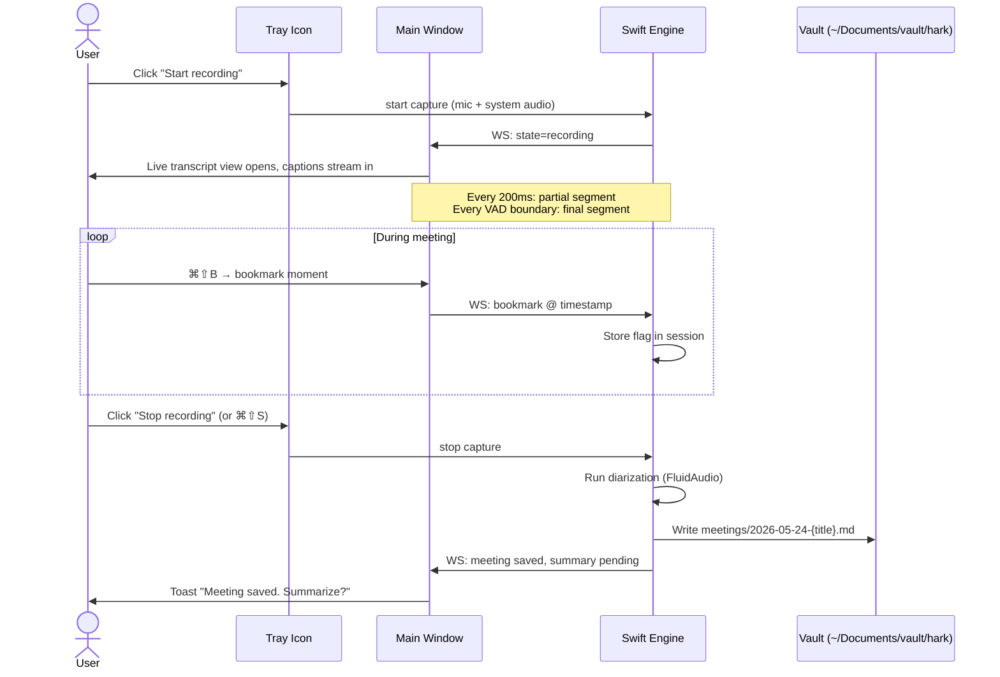

# User Journeys

End-to-end flows from the user's perspective. Each journey names the actor, trigger, happy path, failure paths, and the data that crosses the trust boundary (i.e., goes to Claude API).

## Legend

- 🟢 **Local-only** — happens on the Mac, no network
- 🔵 **Claude API** — explicit user-invoked, transcript text only (never audio)
- 🟡 **Decision point** — user must choose something

---

## Journey 1: First launch & onboarding

**Actor:** New user (you)
**Trigger:** Opens Hark.app for the first time
**Frequency:** Once

| Step | What happens | Trust boundary |
|---|---|---|
| 1 | Welcome screen explains the local-first promise in 3 sentences | 🟢 |
| 2 | Prompt: grant ScreenCapture permission (system audio) | 🟢 |
| 3 | Prompt: grant Microphone permission | 🟢 |
| 4 | 🟡 Choose vault folder (default: `~/Documents/vault/hark`) | 🟢 |
| 5 | 🟡 Paste Anthropic API key (or skip and disable Claude features) | 🟢 — key stored in macOS Keychain |
| 6 | Background: WhisperKit downloads large-v3-turbo CoreML bundle (~800 MB) with progress bar | 🟢 |
| 7 | Background: NLLB-200 translation model downloads (~600 MB) if user enabled translation | 🟢 |
| 8 | Quick tour: "press ⌘⇧R to start, ⌘⇧B to bookmark, ⌘⇧S to stop" | 🟢 |
| 9 | Lands in the tray menu with "Start recording" available | 🟢 |

**Failure modes:**
- Permission denied → graceful explanation + button to open System Settings
- Model download fails → retry button, manual download link
- No API key → Claude features grayed out with tooltip "Paste a key in Settings to enable"

---

## Journey 2: Joining a meeting (the main flow)

**Actor:** Regular user mid-workday
**Trigger:** A meeting starts (Teams/Zoom/etc.) — user clicks Hark tray icon
**Frequency:** 3–6 times per day

**Steps in detail:**

| Step | What happens | Trust boundary |
|---|---|---|
| 1 | User clicks tray icon, picks "Start recording" | 🟢 |
| 2 | Engine begins capturing system audio (ScreenCaptureKit) + mic (AVAudioEngine), mixed to 16kHz mono PCM | 🟢 |
| 3 | Engine streams audio chunks through Silero VAD, then WhisperKit | 🟢 |
| 4 | Partial transcripts appear in main window with <1.5s latency, updated in place as more context arrives | 🟢 |
| 5 | Final segments persist with speaker label `Speaker N` (no name yet — manual tag happens later) | 🟢 |
| 6 | User can: bookmark a moment, pause capture, type quick notes alongside the transcript | 🟢 |
| 7 | If translation mode is ON: translated subtitle appears under each finalized segment | 🟢 if local NLLB / 🔵 if Claude API |
| 8 | User stops recording | 🟢 |
| 9 | Diarization runs (5–15s for a 1-hour meeting on M-series) | 🟢 |
| 10 | Meeting auto-exports to `vault/hark/meetings/YYYY-MM-DD-{title}.md` with frontmatter | 🟢 |
| 11 | Git auto-commits the new meeting file to the vault repo | 🟢 |
| 12 | UI prompts: "Summarize?" | 🟡 |

**Failure modes:**
- ScreenCapture permission revoked mid-session → engine emits warning, falls back to mic-only, UI shows yellow banner
- RTF spikes above 1.0 → engine logs warning, drops oldest unprocessed segment, UI shows "Falling behind" indicator
- Disk full → engine pauses, UI shows blocker error
- Engine crashes → UI shows "Engine stopped" with restart button; partial transcript preserved on disk

---

## Journey 3: Asking the second-brain a question mid-meeting

**Actor:** User actively in a meeting
**Trigger:** Someone mentions a term/project/decision they don't remember
**Frequency:** 1–5 times per meeting

| Step | What happens | Trust boundary |
|---|---|---|
| 1 | User presses ⌘⇧Q (or clicks Q&A panel) | 🟢 |
| 2 | Q&A side-panel opens next to the live transcript | 🟢 |
| 3 | User types: "What did we decide about the Camunda upgrade last month?" | 🟢 |
| 4 | Local embedding search retrieves top-K relevant vault notes + transcripts (BGE-small via CoreML) | 🟢 |
| 5 | Retrieved chunks + question sent to Claude with prompt caching on system prompt | 🔵 — transcript text + vault text, no audio |
| 6 | Answer streams back into the panel with citations linking to source meeting/note files | 🔵 → 🟢 |
| 7 | User clicks a citation → vault file opens in side-panel | 🟢 |

**Expectation set in UX:** 1–3 second response time. This is for *recall*, not reflex. If user needs reflex-speed, they can use the term-capture panel (auto-shows inline definitions of detected vault terms with no network call needed for the lookup itself).

**Failure modes:**
- No API key → "Q&A requires an Anthropic API key. Add one in Settings."
- Network down → graceful failure with "Offline. Q&A will resume when reconnected. Local search still works:" + show top-K results as a fallback.
- No matches found in vault → "Nothing in your vault matches. Try a different phrasing."

---

## Journey 4: Post-meeting review

**Actor:** User after a meeting ended
**Trigger:** Toast notification or opens main window
**Frequency:** Once per meeting

| Step | What happens | Trust boundary |
|---|---|---|
| 1 | User clicks "Summarize" on the just-finished meeting | 🟡 |
| 2 | Transcript text + bookmarks sent to Claude with the summary system prompt | 🔵 |
| 3 | Streamed response: TL;DR + action items {owner, due} + decisions + open questions + LLM-generated chapters | 🔵 → 🟢 |
| 4 | Summary appended to `vault/hark/meetings/YYYY-MM-DD-{title}.md` under headings | 🟢 |
| 5 | Git auto-commits the updated file | 🟢 |
| 6 | User reviews speaker labels — for any `Speaker N`, clicks → types name → saved | 🟢 |
| 7 | Voice embedding for that speaker persisted to `vault/.speakers/{slug}.json` | 🟢 |
| 8 | Next meeting with the same person: auto-labeled, no prompt | 🟢 |

---

## Journey 5: Curating the vault (becomes the second brain)

**Actor:** User during downtime
**Trigger:** Wants to enrich a term that keeps coming up
**Frequency:** Weekly

| Step | What happens | Trust boundary |
|---|---|---|
| 1 | User opens vault folder in Obsidian (or any markdown editor) | 🟢 |
| 2 | Creates `notes/camunda.md` with their own knowledge about Camunda | 🟢 |
| 3 | Saves the file | 🟢 |
| 4 | Hark watches the vault folder via FSEvents → updates local embedding index | 🟢 |
| 5 | Adds "Camunda" to the auto-injected Whisper vocab for future meetings | 🟢 |
| 6 | Next time "Camunda" is mentioned in a call, the term-capture panel shows the inline definition from `notes/camunda.md` | 🟢 |
| 7 | Q&A queries about Camunda now retrieve this note as context | 🟢 (or 🔵 if Q&A invoked) |

---

## What's deliberately missing from these journeys

- **No calendar pre-meeting brief** — corporate Intune blocks Exchange access. Deferred until a viable path exists.
- **No "join Zoom/Teams" button** — out of scope.
- **No multi-user sharing** — personal product first.

## Related

- [User stories](05-user-stories.md) — these journeys decomposed into backlog items
- [Data flows](../design/07-data-flows.md) — the technical view of the same flows
