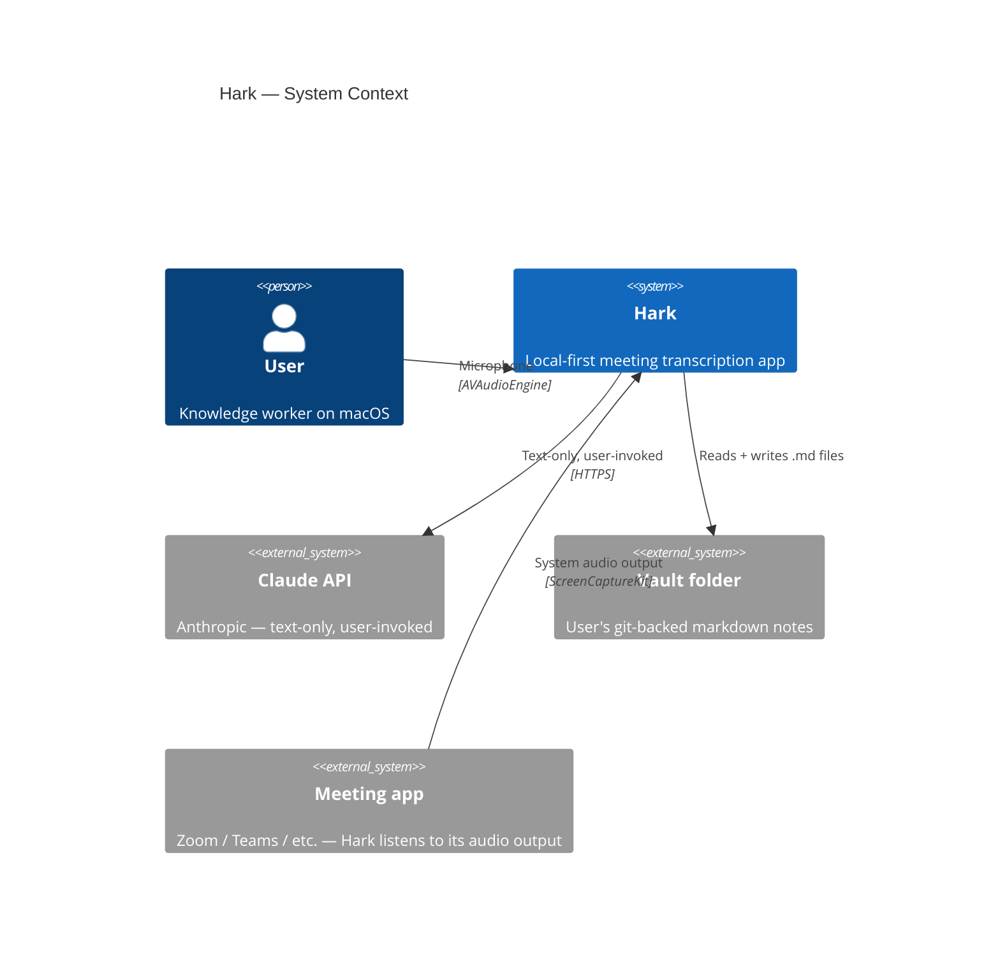
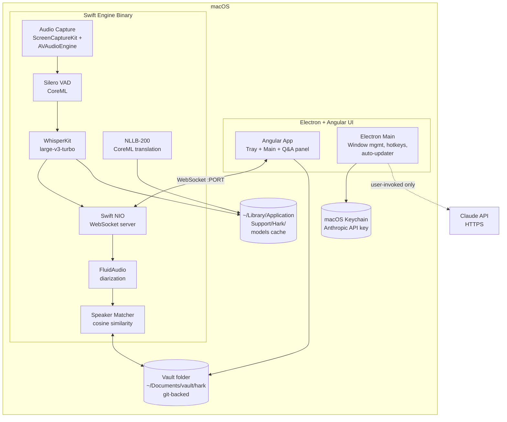
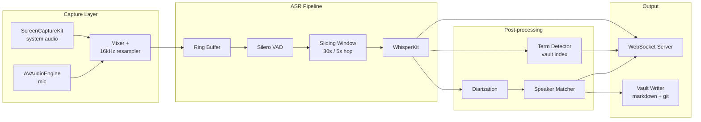
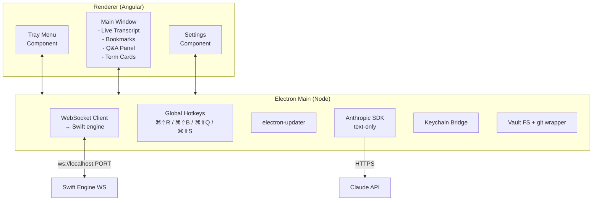

# Architecture Overview

C4-style decomposition, top-down. Skip to the diagram if you just want the shape.

## System context

**Trust boundaries (critical):**
- Everything inside Hark stays on the Mac.
- Vault is on local disk (could be in iCloud Drive, but that's the *user's* choice — Hark doesn't push it anywhere).
- The Claude API edge is the **only** outbound channel. It carries transcript text and vault excerpts. Never audio.

---

## Container view

### Components

| Component | Language | Process | Responsibility |
|---|---|---|---|
| Angular UI | TypeScript | Electron renderer | All user-facing surfaces: tray menu, main window, Q&A panel, settings |
| Electron Main | TypeScript / Node | Electron main | Window/tray management, global hotkeys, auto-updater, Keychain access, Claude API client |
| Swift Engine | Swift | Separate sidecar binary | Audio capture, ASR, diarization, translation, speaker matching, WebSocket server |
| Vault | Plain markdown files + `.git` | (on disk) | Source of truth for transcripts, notes, speaker embeddings |
| App Data | Files in `~/Library/Application Support/Hark/` | (on disk) | Model caches, preferences, indexed embeddings |

### Why a separate Swift engine instead of in-process Node?

- **Performance:** WhisperKit on ANE wants real-time priority; running it inside Electron's main process would deadline-starve UI rendering.
- **Crash isolation:** if the engine OOMs (large model + 4-hour meeting), the UI survives and can offer restart.
- **Permission model:** ScreenCaptureKit permission is per-binary on macOS — keeping it in a stable signed Swift binary is more user-friendly than re-prompting on every Electron update.
- **Language fit:** WhisperKit, ScreenCaptureKit, AVAudioEngine, FluidAudio are all Swift-native. No FFI tax.

### Why Electron, not Tauri or SwiftUI?

See [ADR-0001](~/Documents/project/hark/docs/decisions/0001-electron-over-tauri.md).

---

## Component view: Swift Engine

Each box is roughly a Swift `actor` or a dedicated dispatch queue. Backpressure: if WhisperKit can't keep up (RTF > 1), the ring buffer drops oldest unprocessed audio and emits a warning event over WS. The UI surfaces it as a yellow banner.

---

## Component view: Electron + Angular UI

Renderer talks to Main via Electron IPC. Main holds all sensitive surfaces (Keychain, network, FS). Renderer is locked down: `contextIsolation: true`, `nodeIntegration: false`, strict CSP.

---

## Data stores

| Store | Where | Format | Lifetime |
|---|---|---|---|
| Meetings | `vault/hark/meetings/*.md` | Markdown + YAML frontmatter | Permanent, git-versioned |
| Notes | `vault/hark/notes/*.md` | Markdown | User-managed |
| Speaker embeddings | `vault/.speakers/*.json` | JSON: `{name, embeddings: number[][], meetings_seen}` | Permanent |
| Term index | `~/Library/Application Support/Hark/term-index.sqlite` | SQLite FTS5 | Rebuildable from vault |
| Embedding index (RAG) | `~/Library/Application Support/Hark/embeddings.sqlite` | SQLite + sqlite-vec | Rebuildable from vault |
| Model cache | `~/Library/Application Support/Hark/models/` | CoreML bundles | Permanent |
| Preferences | `~/Library/Application Support/Hark/prefs.json` | JSON | User settings |
| Anthropic API key | macOS Keychain | n/a | User-managed |
| Logs | `~/Library/Logs/Hark/*.log` | Plain text, rotated | 7-day retention |

**Why SQLite for embedding index?** Local-only, zero dependency, fast enough for 100K+ chunks, supports vector similarity via `sqlite-vec` extension. No need for Pinecone/Weaviate.

---

## Threat model summary

| Threat | Mitigation |
|---|---|
| Closed-source binary captures and exfiltrates audio | Hark is open-source (planned); audio path is auditable; `privacy-auditor` agent runs each release |
| Network attacker MITM the Claude API call | TLS pinning unnecessary — Anthropic SDK handles cert validation; we trust Anthropic's transport |
| Local malware reads the vault | Out of scope — vault is plain files; user's responsibility to secure their disk (FileVault recommended) |
| API key leaks to logs or commits | Stored in Keychain, never written to disk in plaintext, never logged; `privacy-auditor` checks for `sk-ant-` patterns in code |
| User accidentally records a confidential conversation | Pause button always visible; ⌘⇧S kills capture instantly; redact-before-send on by default |
| Speaker fingerprint reverse-engineered to identify someone | Embeddings stay local; never networked. Trust boundary: the disk the embeddings live on. |

---

## Related

- [Data flows](07-data-flows.md) — sequence diagrams for each major flow
- [WebSocket API contract](08-websocket-api-contract.md) — message schemas
- Handoff doc — stack rationale
- ADRs — individual decisions
