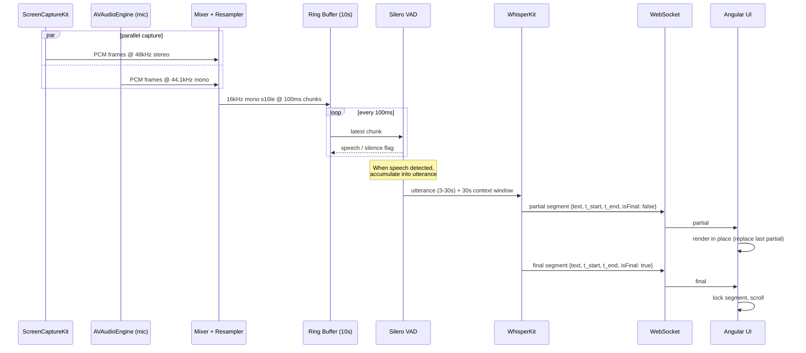
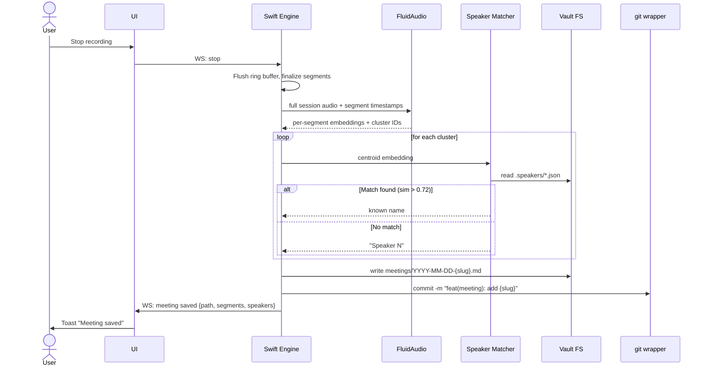
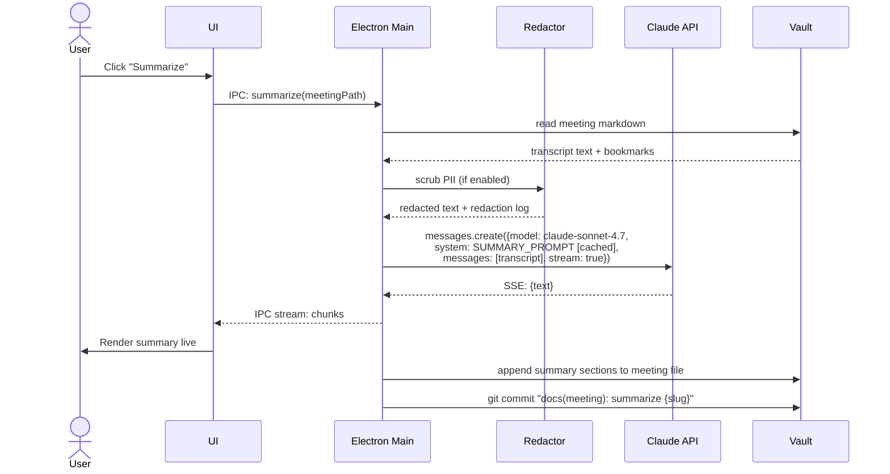
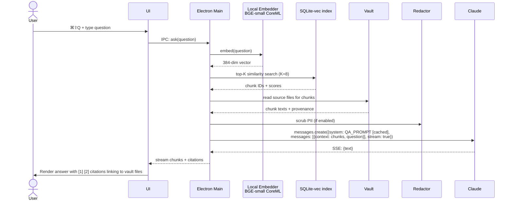
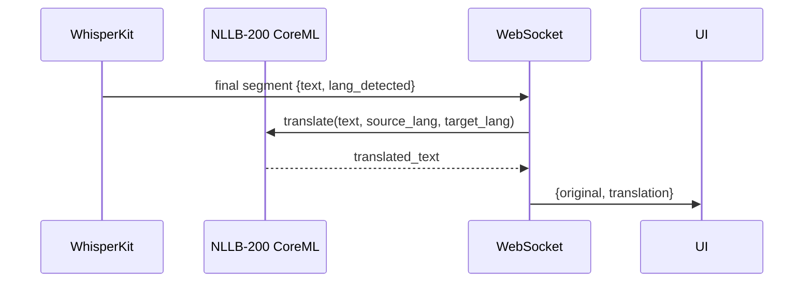
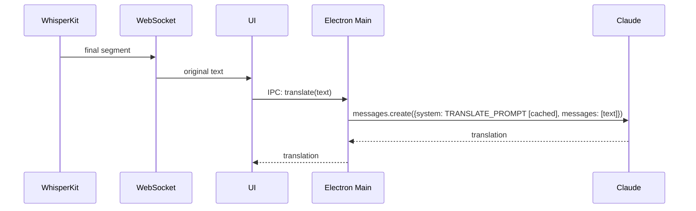
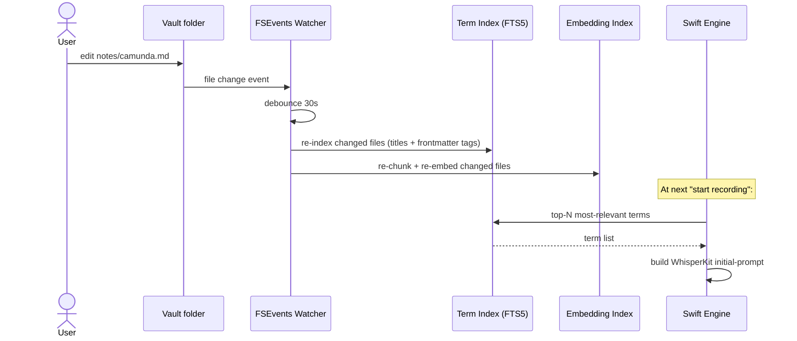

# Data Flows

The pipelines that move bytes through Hark. Each flow names: who produces, who consumes, latency budget, failure behavior.

## 1. Live audio → live caption (the hot path)

**Latency budget:** spoken word → visible text ≤ 1.5s p95
**Throughput target:** sustain RTF < 0.5



**Backpressure rule:** if `Ring.fill > 8s` for >2s straight, drop the oldest unprocessed chunk and emit `{type: "warning", code: "rtf_high"}` over WS. UI shows yellow banner.

**Failure modes:**
| Failure | Detection | Response |
|---|---|---|
| ScreenCapture permission revoked | SCK callback error | Stop SCK, continue mic-only, WS event `{type: "warning", code: "sck_lost"}` |
| WhisperKit OOM | Swift `MemoryWarning` | Save state, restart WhisperKit instance, replay last 5s |
| Engine crashes | UI WS disconnect | Reconnect with backoff; if engine missing, prompt user to restart it |

---

## 2. Capture end → diarization → vault file

**Latency budget:** stop pressed → file in vault ≤ 5s for a 60-min meeting



**The vault file shape:**

```markdown
---
title: Q2 Planning Sync
date: 2026-05-24T10:30:00+07:00
duration_sec: 2715
attendees: [Alice Chen, Speaker 2, Speaker 3]
bookmarks: 4
hark_version: 0.1.0
---

## Transcript

> **Alice Chen** · 10:30:02
> Welcome everyone. Let's start with the Camunda migration status...

> **Speaker 2** · 10:30:18
> [[Camunda]] migration is at 80%. Two services left to cut over.

> 📌 **Speaker 2** · 10:31:42
> We decided to push the cutover to next Monday.

...
```

---

## 3. Post-meeting summary (Claude API path — the only outbound channel)

**Latency budget:** stream first token ≤ 3s; full summary ≤ 30s for 60-min meeting



**What's sent:**
- ✅ Transcript text (post-redaction if enabled)
- ✅ Bookmark timestamps
- ✅ The SUMMARY_PROMPT system message (cached)
- ❌ Audio bytes — NEVER
- ❌ Speaker voice embeddings — NEVER
- ❌ Speaker real names if redact-before-send is ON (replaced with `Speaker A`, `Speaker B`)

**Prompt caching strategy:** the SUMMARY_PROMPT is ~2000 tokens of formatting instructions and example output. Cached, so cost is ~$0.0003 per summary regardless of transcript length (input transcript dominates cost).

---

## 4. In-meeting Q&A (RAG over vault)

**Latency budget:** retrieval ≤ 200ms local; first token from Claude ≤ 3s



**Embedding index lifecycle:**
- Built on first run by walking the vault folder
- Updated incrementally via FSEvents on vault changes (debounced 30s)
- Rebuildable from scratch in < 60s for a 1000-note vault (BGE-small is fast on ANE)

---

## 5. Translation (two modes)

### 5a. Fast mode (local NLLB-200)

**Latency budget:** segment finalized → translated line shown ≤ 500ms



### 5b. High-quality mode (Claude API)

**Latency budget:** segment finalized → translated line shown ≤ 3s



User toggles mode in Settings. Subsequent segments use the new mode immediately.

---

## 6. Vault watcher → term index → Whisper vocab



---

## Cross-cutting concerns

### Cost accounting (Claude API)

Tracked per session, logged locally. Settings → Privacy shows last-7-day spend so user has no surprises.

| Action | Avg tokens in | Avg tokens out | Cost @ Sonnet 4.7 |
|---|---|---|---|
| Summary (60-min meeting) | ~8,000 (cached after first) | ~800 | ~$0.02 |
| Q&A query | ~3,500 (mostly cached) | ~300 | ~$0.005 |
| Translation chunk (high-quality) | ~100 | ~100 | ~$0.0005 |

At 4 hours of meetings/day with 1 summary each + 5 Q&A + ~20 translation chunks: **~$0.15/day**.

### Local logging

- Path: `~/Library/Logs/Hark/`
- Files: `engine.log`, `ui.log`, `claude-cost.log`, `redaction.log`
- Format: JSON-lines, 7-day rotation
- Never contains: transcript text, audio, vault contents, API keys
- Always contains: timestamps, event types, error stacks, performance counters (RTF, latency, RAM)

## Related

- [Architecture overview](06-architecture-overview.md)
- [WebSocket API contract](08-websocket-api-contract.md) — message schemas referenced above
- [Privacy test checklist](../qa/09-test-strategy.md#privacy-checklist)
